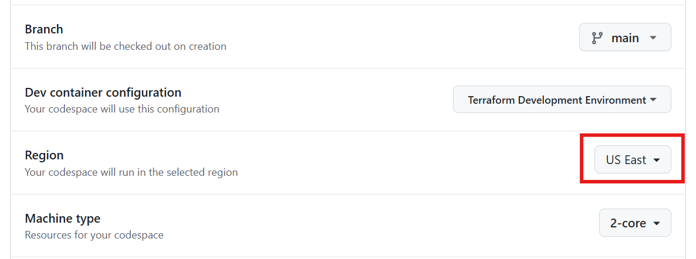
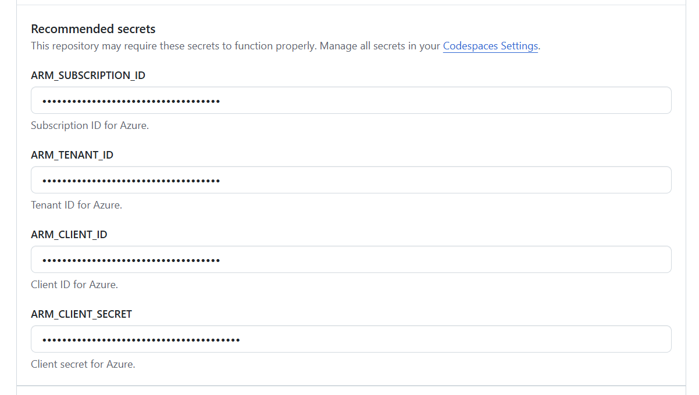
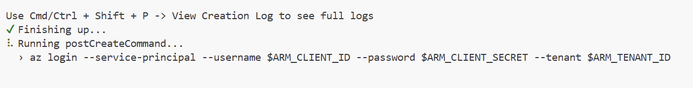
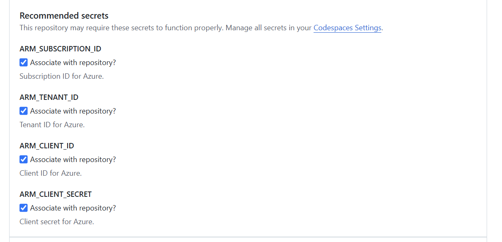

# Welcome to the Azure Terraform Advanced Class! 🚀

Welcome to the Azure Terraform Advanced labs! This hands-on learning experience will guide you through advanced concepts with Terraform and Microsoft Azure.

## 📚 Lab Repositories

Please complete the labs in the following order:

1. **[Terraform Review](https://codespaces.new/ned-in-the-cloud/ata-terraform-review)**
1. **[Dynamic Expressions]()**
1. **[Lifecycle Blocks]()**
1. **[Moved and Removed Blocks]()**
1. **[Importing Existing Infrastructure]()**
1. **[Getting Started with HCP Terraform]()**
1. **[Setting Up a VCS Workflow]()**
1. **[Working with the Private Registry]()**
1. **[Using Pre/Post Conditions]()**
1. **[Using the Terraform Test Framework]()**
1. **[CI/CD with HCP Terraform]()**
1. **[Sentinel Policies]()**

## 🛠️ Getting Started

### Using GitHub Codespaces

Each lab link will launch a GitHub Codespace. A codespace is a sandboxed environment running in your browser that includes the lab directions, starter code, and a terminal to run commands. All the necessary tools and applications are already installed in the codespace, including Terraform, Azure CLI, jq, git, and lots more.

When you launch the Codespace for each lab, accept the defaults for the branch (*main*), image name (*Terraform Development Environment*), and size (*2-core*). Make sure the region should is set to **US East**.

The image for the Codespace is pre-built in the US East region and so will launch faster than any other region.

You will be prompted to fill out secrets for the Codespace. Use the information provided by your instructor for each value.

These secrets will be stored in the *Codespace Settings* of your GitHub account. You only need to fill them out once and they can be re-used for all subsequent Codespaces you launch.

When the Codespace launches, it will run a post deployment command to log you into the Azure CLI.

Please allow the command to complete.

When you launch other Codespaces, you can select the secrets you've already stored.

Tick each check box to use the same credentials with the new Codespace.

If you close a Codespace and need to return, you can view all your [currently running Codespaces here.](https://github.com/codespaces) Please DO NOT launch a new Codespace for the same lab!

When you are done with the Codespace for a lab, you can simply close the browser tab. The Codespace will automatically delete itself after 24 hours. You can also delete the Codespace from the [Codespaces dashboard view](https://github.com/codespaces).

## ⚠️ Important Reminders

### Resource Management

- **Nightly Cleanup**: All Azure lab resources are automatically cleaned up every night to prevent unnecessary costs
- **Plan Accordingly**: Complete your lab work within a single day, or be prepared to recreate resources if you continue the next day
- **Credentials expiration**: Your credentials will expire the 3 days following the last class

### Codespace Limitations

- **Timeout**: Codespaces will timeout after **120 minutes** of inactivity
- **Deletion**: Codespaces are automatically deleted after **1 day**
- **No Commits**: You have been granted *Write* access to the repository. Please do not create branches or pull requests.
- **Max Codespaces**: You are limited to 10 concurrently running Codespaces. In the unlikely event you run out, clean up your running Codespaces from the [Codespaces dashboard view](https://github.com/codespaces).

## 📞 Support

If you encounter any issues during the labs:

1. Check the README file in each repository for specific instructions
2. Review the Terraform documentation for additional guidance
3. Reach out to your instructor or teaching assistant

---

Last updated: October 2, 2025
